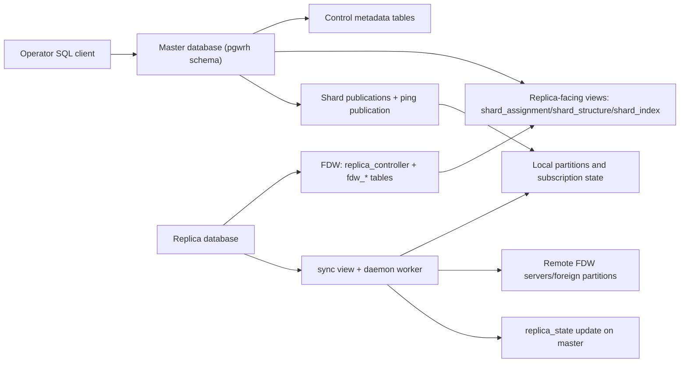
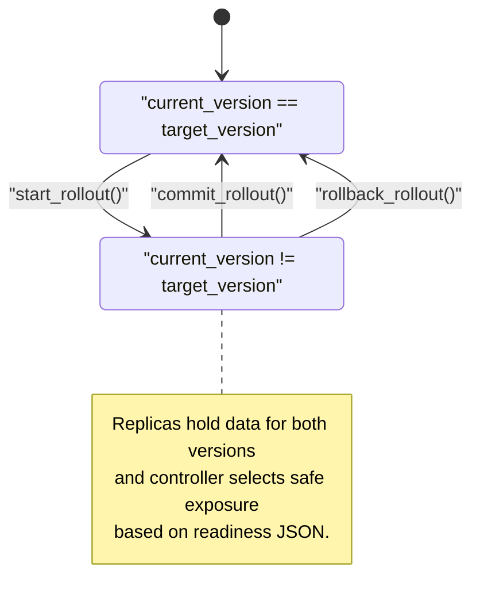
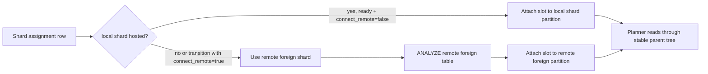

# pgwrh Contributor Architecture

This document describes `pgwrh` internals for contributors. API and behavior here are derived from SQL sources under `src/`.

## Design Goals

- Read scalability across many PostgreSQL replicas.
- No custom SQL parser/router.
- Zero-downtime topology/config rollouts.
- Keep implementation in SQL/PLpgSQL.

## Core Decisions

1. Use native PostgreSQL primitives.
   - Local shards: logical replication subscriptions/publications.
   - Remote shards: `postgres_fdw` foreign partitions.
   - Query routing: partition attach/detach, partition pruning, FDW pushdown.
2. Use double-buffered config versions (`FLIP`/`FLOP`).
   - `current_version` serves traffic.
   - `target_version` is being converged.
   - Commit is gated by explicit readiness checks.
3. Generate desired actions declaratively.
   - Replica `sync` view computes scripts to apply.
   - Worker executes scripts synchronously/asynchronously depending on command type.
4. Track extension-owned objects through `pg_depend`.
   - Managed objects are explicitly tied to extension metadata.
   - Cleanup logic can safely distinguish managed vs unmanaged objects.

## Build and Module Layout

Build order is dependency-driven (`tsort`) and final install script is concatenated from:
- `src/common.sql`
- `src/master/*.sql`
- `src/replica/*.sql`

Key modules:
- Master metadata/state machine: `src/master/tables.sql`, `src/master/triggers.sql`, `src/master/api-management.sql`
- Assignment logic: `src/master/snapshot.sql`, `src/master/implementation-views.sql`
- Replica-facing control API: `src/master/api-replica.sql`
- Replica reconciler: `src/replica/sync.sql`, `src/replica/daemon.sql`
- Replica controller bootstrap: `src/replica/api-management.sql`

## Component Diagram

## Data Model and Versioning

Primary entities:
- `replication_group`: identity + `current_version`/`target_version`.
- `replication_group_config`: per-version policy (`min_replica_count`, `min_replica_count_per_availability_zone`).
- `replication_group_member` and `shard_host`: logical member and shard-host endpoint.
- `shard_host_weight`: per-version weights.
- `sharded_table`: per-version table coverage + replication factor + sharding-key expression.
- `shard_index_template`: per-version index templates.
- Snapshot outputs: `shard`, `shard_assigned_host`, `shard_assigned_index`.

Triggers enforce lifecycle constraints:
- Inserts into mutable config tables are redirected to pending version.
- Locked versions are immutable.
- Clone table copies previous config into pending on first mutation.
- Snapshot is generated when config lock row for target version is inserted.

## Rollout State Machine

## Assignment Algorithm

`replication_group_config_snapshot(group, version)`:
- Discovers leaf partitions under configured sharded roots.
- Computes required replica count as max of:
  - `ceil(replication_factor * host_count / 100)`
  - `min_replica_count` (clamped by host count)
  - `min_replica_count_per_availability_zone * az_count` (clamped)
- Uses weighted rendezvous hashing score to rank hosts.
- Saves shard-host assignments and applicable index templates.

This keeps placement deterministic and minimizes movement when topology changes.

## Replica Control Plane API

Master exposes per-member filtered views (by `CURRENT_ROLE`):
- `shard_structure`: required local table/partition DDL.
- `shard_assignment`: per-shard local vs remote routing and remote endpoint credentials.
- `shard_index`: expected indexes per shard, with optionality.
- `credentials`: current credential pair for remote shard access.
- `replica_state`: writable view used by replicas to report readiness.

Replica maps these through foreign tables (`fdw_*`) on server `replica_controller`.
Remote shard connections are built as libpq multi-host strings (`host`/`port` lists) with one shared `dbname`, so all participating shard hosts must use the same database name.

## Replica Reconciler (`sync` View)

`src/replica/sync.sql` emits rows:
- `async`: run in background worker or foreground.
- `transactional`: whether command group may run in one transaction.
- `description`: human-readable operation.
- `commands[]`: SQL commands to execute.

Operation classes include:
- Create/drop schemas and table structure.
- Manage logical subscription publications per hosted shard.
- Create/drop indexes from templates.
- Create/update/drop remote FDW servers and foreign tables.
- ANALYZE remote foreign tables before exposing them.
- Attach slot partition to local or remote shard depending on readiness.

## Worker Execution Model

- `sync_daemon()` loop takes advisory lock to ensure singleton worker per DB.
- `sync_step()` materializes `sync` rows and dispatches scripts.
- Non-transactional commands (e.g. `ALTER SUBSCRIPTION`) are executed using `pg_background` outside current transaction context.
- After reconciliation, worker calls `report_state()` and cleanup helpers.

## Readiness Gating and Safety

Controller checks before commit:
- No missing local connected shards for target version.
- No missing remote connected shards for target version.

Replica exposure logic in `shard_assignment_per_member` only points to target remote hosts when:
- target shard subscriptions are confirmed,
- target hosts are online,
- target users are created,
- required indexes are reported.

This prevents routing traffic to not-yet-ready hosts.

## Architectural Diagram: Local vs Remote Slot Attachment

## Extension Ownership and Cleanup Strategy

The extension records managed objects in `pg_depend` (`deptype='n'`) via helper functions.
This allows cleanup logic to:
- drop only extension-managed publications/servers/schemas,
- avoid touching non-`pgwrh` objects,
- retain compatibility with `pg_extension_config_dump` for backup/restore.

## Contributor Notes

- Public operator API is mainly in `src/master/api-management.sql` and `src/replica/api-management.sql`.
- Most behavior changes should be implemented by adjusting derived views (`implementation-views.sql`, `sync.sql`) and preserving trigger invariants.
- Keep non-transactional operations in worker paths that use `pg_background`.
- Update `src/updates/*.sql` when changing behavior for already-released versions.
