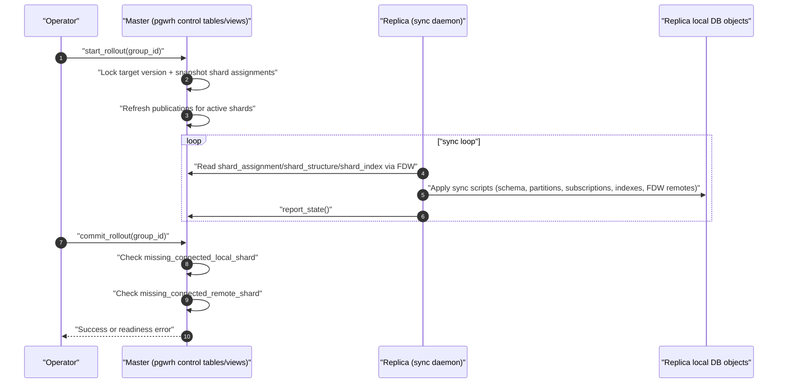
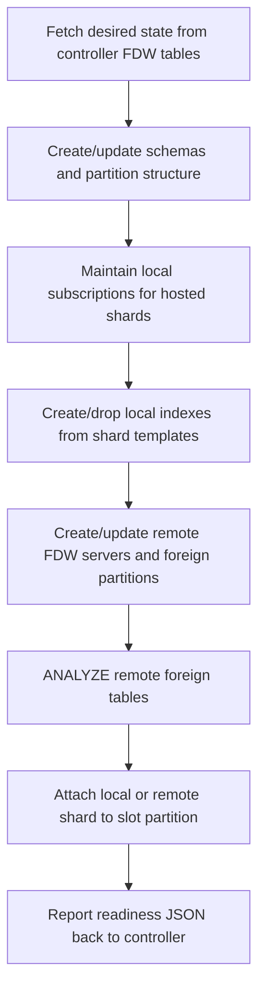

# pgwrh Operator Guide

This guide describes how to operate `pgwrh` based on the SQL API defined in the extension source.

## Scope

`pgwrh` is a read-scaling extension that:
- Uses PostgreSQL partitioning leaves as shards.
- Uses logical replication to keep local shards synced.
- Uses `postgres_fdw` foreign partitions for remote shard access.
- Supports rolling topology/config changes with two config versions (`FLIP`/`FLOP`).

## Prerequisites

- PostgreSQL 16+.
- Extensions: `pgwrh`, `postgres_fdw`, `pg_background`.
- Same database name is required on master and all replicas.
  `pgwrh` builds multi-host libpq connection strings for cross-replica load balancing (`host=...` / `port=...`) and libpq supports only one `dbname` per connection string shared by all hosts.

## Operational Model

- Master stores cluster metadata and per-version shard assignments.
- Each replica pulls desired state from master through FDW tables and reconciles itself.
- A rollout has two phases:
1. `start_rollout` exposes target config.
2. `commit_rollout` promotes it after readiness checks pass.

## API Reference (Master)

### Cluster lifecycle

- `pgwrh.create_replica_cluster(_replication_group_id text)`
- `pgwrh.start_rollout(_replication_group_id text)`
- `pgwrh.commit_rollout(group_id text, keep_old_config boolean DEFAULT false)`
- `pgwrh.rollback_rollout(_replication_group_id text, unlock boolean DEFAULT true)`

### Replica membership

- `pgwrh.add_replica(_replication_group_id text, _replica_id text, _host_name text, _port int, _member_role regrole DEFAULT NULL, _availability_zone text DEFAULT 'default', _weight int DEFAULT 100)`
- `pgwrh.set_replica_weight(_replication_group_id text, _availability_zone text, _replica_id text, _weight int)`

Notes:
- If `_member_role` is not provided, `_replica_id` must be an existing role name.
- `set_replica_weight` requires availability zone.

### Key control tables

- `pgwrh.sharded_table`
- `pgwrh.shard_index_template`
- `pgwrh.replication_group_config`
- `pgwrh.shard_host` and `pgwrh.shard_host_weight`

Important behavior:
- `BEFORE INSERT` triggers on `sharded_table`, `shard_host_weight`, `shard_index_template` force inserts into the next pending version.
- Current locked version cannot be modified.

## API Reference (Replica)

### Bootstrap

- `pgwrh.configure_controller(host text, port text, username text, password text, start_daemon boolean DEFAULT true, refresh_seconds real DEFAULT 20)`

What it does:
- Configures FDW server `replica_controller` to the master.
- Configures user mapping.
- Creates/enables trigger on replicated `ping` table to ensure daemon is running.
- Creates a logical subscription to controller ping publication.
- Optionally starts the sync daemon.

### Internal operational helpers (usually automatic)

- `pgwrh.start_sync_daemon(seconds real, application_name text DEFAULT 'pgwrh_sync_daemon')`
- `pgwrh.report_state()`

## Standard Procedure

### 1. Install extension

On master and every replica:

```sql
CREATE EXTENSION pgwrh CASCADE;
```

### 2. Define partitioned tables

Create your partition hierarchy first. `pgwrh` assigns leaf partitions.

### 3. Create cluster

```sql
SELECT pgwrh.create_replica_cluster('c01');
```

### 4. Configure sharded tables

```sql
INSERT INTO pgwrh.sharded_table (
  replication_group_id,
  sharded_table_schema,
  sharded_table_name,
  replication_factor
)
VALUES
  ('c01', 'test', 'my_data', 50),
  ('c01', 'test', 'my_data_2024', 100);
```

### 5. Add replica members

```sql
CREATE ROLE c01_replica;
GRANT SELECT ON ALL TABLES IN SCHEMA test_shards TO c01_replica;

CREATE USER c01r01 PASSWORD 'c01r01Password' REPLICATION IN ROLE c01_replica;
SELECT pgwrh.add_replica('c01', 'c01r01', 'replica01.cluster01.myorg', 5432);
```

### 6. Configure each replica

Run on each replica:

```sql
SELECT pgwrh.configure_controller(
  host => 'master.cluster01.myorg',
  port => '5432',
  username => 'c01r01',
  password => 'c01r01Password'
);
```

### 7. Roll out

On master:

```sql
SELECT pgwrh.start_rollout('c01');
```

Wait for readiness, then:

```sql
SELECT pgwrh.commit_rollout('c01');
```

If rollout must be cancelled:

```sql
SELECT pgwrh.rollback_rollout('c01');
```

## Monitoring and Readiness

Use these views on master:
- `pgwrh.replication_status` for slot lag/session count.
- `pgwrh.missing_subscribed_shard`
- `pgwrh.missing_connected_local_shard`
- `pgwrh.missing_connected_remote_shard`

If `commit_rollout` fails, inspect the missing_* views first.

## Known Limitations

- Read scaling only. `pgwrh` does not provide multi-writer/write-sharding semantics; writes are expected on the source side and replicated outward.
- Shard unit is a leaf partition. Unpartitioned tables or non-leaf partition nodes are not independently assigned.
- No high-level `remove_replica(...)` management API is currently exposed. Member removal requires direct metadata manipulation and should be treated as an advanced/manual operation.
- Same database name is mandatory across shard hosts because remote access uses libpq multi-host connection strings with a single shared `dbname`.
- Non-transactional DDL (for example subscription changes) depends on `pg_background`; environments that cannot use it are not supported by current implementation.
- There is a known race during subscription publication drop and schema cleanup (explicitly marked `FIXME` in sync logic), so cleanup may converge one cycle later.

## Common Operations

### Change host weight

```sql
SELECT pgwrh.set_replica_weight('c01', 'default', 'c01r01', 200);
SELECT pgwrh.start_rollout('c01');
SELECT pgwrh.commit_rollout('c01');
```

### Update redundancy floor

```sql
UPDATE pgwrh.replication_group_config
SET
  min_replica_count = 2,
  min_replica_count_per_availability_zone = 1
WHERE
  replication_group_id = 'c01'
  AND version = pgwrh.next_pending_version('c01');

SELECT pgwrh.start_rollout('c01');
SELECT pgwrh.commit_rollout('c01');
```

### Temporarily drain remote serving from a host

```sql
UPDATE pgwrh.shard_host
SET online = false
WHERE replication_group_id = 'c01'
  AND availability_zone = 'default'
  AND host_id = 'c01r01';
```

This change is consumed by replica sync logic directly and does not require version promotion.

## Rollout Diagram



## Replica Convergence Pipeline


