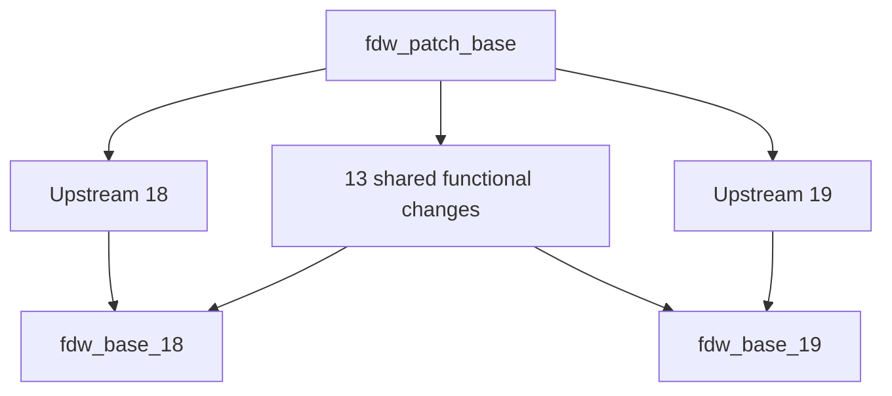

# Upstream provenance and patch workflow

Source: https://github.com/postgres/postgres

| PostgreSQL | Source tag | Original commit | Pristine bookmark | Patched aggregate | Directory in main |
| --- | --- | --- | --- | --- | --- |
| 18.3 | `REL_18_3` | `62d6c7d3df6287f1bd83199c1a746e50d31571a0` | `upstream/postgres_fdw` | `fdw_base_18` | `pgwrh_fdw/18/` |
| 19 Beta 3 (preview) | `REL_19_BETA3` | `3638289fb57bdabec00deda98ee9624a35f5d66a` | `upstream/postgres_fdw_19` | `fdw_base_19` | `pgwrh_fdw/19/` |

Each pristine bookmark contains unmodified PostgreSQL history filtered to
`contrib/postgres_fdw`. The annotated `upstream/REL_*` tags record the original
full-repository commit and the filtered path. Each directory's `COPYRIGHT`
comes from its matching PostgreSQL release.

## History layout

The functional patches apply to the filtered tree at the repository root,
retaining upstream C/header filenames and regression-test paths. Each change
contains its implementation and tests. Dependencies remain explicit; the SCRAM
verifier change is independent of the routing changes.

The 13 functional changes form one shared graph rooted at `fdw_patch_base`,
the common upstream ancestor `f001c8a7943425e12cf4d0498a82837acf722eb6`.
Keep this base fixed when updating an individual PostgreSQL version: using an
18-only or 19-only upstream tip here would bring that branch's changes into the
other version.

Each `fdw_base_MAJOR` bookmarks one aggregate with 14 direct parents: the same
13 shared patch commits and that major's pristine upstream tip. The aggregates
resolve the build, SQL and export lists, renamed upstream regression files, and
version-specific APIs. PostgreSQL 19 adaptations belong in `fdw_base_19`; shared
behavior belongs in the common patches. Neither aggregate contains directory
moves or import tooling. The former per-major patch copies remain in historical
release ancestry, but are no longer the maintained patch sets.



Non-squashed Git subtree imports place these exact aggregates under
`pgwrh_fdw/18/` and `pgwrh_fdw/19/`. Tests stay inside each imported tree.
The common `pgwrh_fdw/Makefile` selects the directory using `PG_CONFIG` and
excludes the test-only `context_probe` module from installed packages.

There is one `main` and one pgwrh release version. SQL, UI and `pgwrh_wait`
remain shared; the wait extension isolates PostgreSQL API differences in
`pgwrh_wait/src/compat.h`. Existing release ancestry remains intact.

```sh
jj log -r 'parents(fdw_base_18) & parents(fdw_base_19)'
jj diff -r fdw_base_18
jj diff -r fdw_base_19
```

Functional patches can be reviewed or exported without removing a directory
prefix. Proposals for PostgreSQL itself still need to select relevant changes
and adapt the extension-specific API and tests.

## Changing shared behavior

Edit the relevant shared change once. jj rebases both descendant aggregates;
resolve any conflicts in each aggregate and test both major versions. Upstream
regression files retain their major-specific contents even though the extension
identity patch renames them. Do not resolve these conflicts by copying one
major's tests over the other.

Perform patch maintenance in a disposable FDW-only jj repository, fetching
`fdw_patch_base`, both `fdw_base_*` bookmarks and both pristine bookmarks without
`main`. This keeps automatic descendant rebases away from the project layout
and its release history. For example, with a fresh destination directory:

```sh
git init /tmp/pgwrh-fdw-maintenance
git -C /tmp/pgwrh-fdw-maintenance fetch --no-tags /path/to/pgwrh \
  'refs/heads/fdw_*:refs/heads/fdw_*' \
  'refs/heads/upstream/postgres_fdw*:refs/heads/upstream/postgres_fdw*'
jj git init --colocate /tmp/pgwrh-fdw-maintenance
cd /tmp/pgwrh-fdw-maintenance
jj edit SHARED_CHANGE_ID
```

For published patches, add a shared follow-up change instead of rewriting a
released revision. Include it in both aggregates while retaining their existing
parents. Published aggregates can be duplicated individually onto those parents
plus the new shared change; the functional patches themselves are not copied.
After validation, import the updated aggregate bookmarks back into pgwrh and
refresh both subtrees as described below. An updated root-level aggregate alone
does not refresh the imported source directory.

## Updating one major

Record that major's current pristine commit before importing. Fetch the selected
release into a separate PostgreSQL checkout, then run from the pgwrh root:

```sh
jj log -r upstream/postgres_fdw_19 --no-graph -T 'commit_id ++ "\n"'
python3 pgwrh_fdw/tools/import-upstream.py /path/to/postgres REL_19_BETA3
```

Use a **new** selected release tag; the example above is already imported.
The helper accepts `REL_18_N`, `REL_19_N`, beta and RC tags. It filters history in
a disposable clone and atomically updates only that major's pristine bookmark
and new annotated tag. Existing tags and unrelated histories are rejected.
Patched aggregates, `main` and working files remain untouched.

Keep `git filter-branch --subdirectory-filter contrib/postgres_fdw` as the
extraction method so filtered history retains compatible ancestry. The first
import of a major creates its pristine bookmark; subsequent imports must be
fast-forwards.

In the FDW-only maintenance repository, fetch the new pristine tip and replace
only the corresponding aggregate's upstream parent. Preserve every shared patch
parent and the aggregate's existing resolutions:

```sh
jj rebase -s fdw_base_19 \
  -o 'parents(fdw_base_19) ~ OLD_UPSTREAM_ID' \
  -o upstream/postgres_fdw_19
```

If the aggregate is already published, duplicate **only the aggregate** instead
of rebasing it, then point its bookmark at the new change:

```sh
jj duplicate fdw_base_19 \
  -o 'parents(fdw_base_19) ~ OLD_UPSTREAM_ID' \
  -o upstream/postgres_fdw_19
jj bookmark set fdw_base_19 -r NEW_AGGREGATE_ID
```

Resolve PostgreSQL 19 compatibility conflicts in this aggregate. The 13 shared
patch commits and the PostgreSQL 18 aggregate stay unchanged. Verify the
standalone build and tests. Use a disposable Git checkout of `main` to integrate
the reviewed aggregate:

```sh
git subtree merge --prefix=pgwrh_fdw/19 NEW_AGGREGATE_COMMIT_ID
```

Fetch the resulting commit back into the jj repository and advance `main` after
validation. Do not Git-checkout over an active jj working copy or ordinarily
jj-merge the root-level FDW tree into `main`; the layouts differ. For PostgreSQL
18, use `fdw_base_18`, `upstream/postgres_fdw` and `pgwrh_fdw/18` throughout.

Review upstream SQL and tests alongside C changes. Refresh the provenance table,
`COPYRIGHT` and matching source pins in the FDW CI and Nix preview definition.
The imported directory must match the aggregate exactly.

## Validation and release

Select a matching `PG_CONFIG` for each major and run:

```sh
python3 test/pgwrh_fdw/test_upstream_import.py
make test-fdw
PG_SOURCE=/path/to/matching/postgres/source make test-fdw-tap
make test-packaging
make test-wait
make test-pgwrh
make test-ui
```

CI runs the shared integration suites and independent FDW suites for both majors.
The importer tests exercise preservation of the other major, dirty working files,
immutable provenance tags, unrelated-history rejection and later subtree updates.
Publish `fdw_patch_base`, the pristine and aggregate bookmarks, and annotated upstream tags together
with the reviewed integration. See [PostgreSQL compatibility](../docs/development/postgres-versions.md)
for the preview-to-release checklist.
