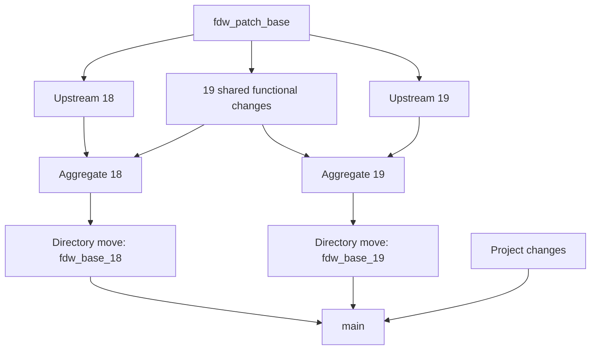

# Upstream provenance and patch workflow

Source: https://github.com/postgres/postgres

| PostgreSQL | Source tag | Original commit | Pristine bookmark | Aggregate | Directory-move bookmark |
| --- | --- | --- | --- | --- | --- |
| 18.3 | `REL_18_3` | `62d6c7d3df6287f1bd83199c1a746e50d31571a0` | `upstream/postgres_fdw` | `fdw_base_18-` | `fdw_base_18` |
| 19 Beta 3 (preview) | `REL_19_BETA3` | `3638289fb57bdabec00deda98ee9624a35f5d66a` | `upstream/postgres_fdw_19` | `fdw_base_19-` | `fdw_base_19` |

Each pristine bookmark contains unmodified PostgreSQL history filtered to
`contrib/postgres_fdw`. The annotated `upstream/REL_*` tags record the original
full-repository commit and the filtered path. Each directory's `COPYRIGHT`
comes from its matching PostgreSQL release.

## History layout

The 19 functional changes form one shared graph rooted at `fdw_patch_base`,
the common upstream ancestor `f001c8a7943425e12cf4d0498a82837acf722eb6`.
They apply to the filtered tree at the repository root, retaining upstream
C/header filenames and regression-test paths. Each change contains its
implementation and tests. Dependencies remain explicit; the SCRAM verifier
change is independent of the routing changes.

Each aggregate has 20 direct parents: the same 19 shared patch commits and
its major's pristine upstream tip. The aggregates resolve build, SQL and export
lists, renamed regression files and version-specific APIs. PostgreSQL 19
adaptations belong in `fdw_base_19-`; shared behavior belongs in the common
patches. Keep `fdw_patch_base` fixed when updating one major so its upstream
branch's changes do not enter the other major.

Each `fdw_base_MAJOR` bookmarks a pure directory-move change with **one parent**:
its aggregate. It puts the aggregate's exact tree under `pgwrh_fdw/MAJOR/`.
Both move changes are parents of the project integration ancestor of `main`.
The project branch contains the common wrapper, documentation and tools; the
versioned FDW sources come exclusively from the move parents.



There is one `main` and one pgwrh release version. SQL, UI and `pgwrh_wait`
remain shared; the wait extension isolates PostgreSQL API differences in
`pgwrh_wait/src/compat.h`. The common `pgwrh_fdw/Makefile` selects its versioned
directory using `PG_CONFIG` and excludes the test-only `context_probe` module
from installed packages. Existing releases and historical subtree imports remain
in ancestry; current maintenance uses jj directory moves and merges.

```sh
# Shared functional changes, aggregate adaptations, and the mechanical move:
jj log -r 'parents(fdw_base_18-) & parents(fdw_base_19-)'
jj diff -r fdw_base_19-
jj diff -r fdw_base_19 --summary
```

Functional patches can be reviewed or exported without removing a directory
prefix. Proposals for PostgreSQL itself still need to select relevant changes
and adapt the extension-specific API and tests.

The lookup implementation is shared in `sqmzztxu` and `yznpkzqo`; the related
LIMIT regression adaptation is `ynssotmk`. These are additional parents of the
existing aggregates (`lvwzssxp` for 18 and `mqpxytlz` for 19), whose existing
directory moves have been refreshed. No additional aggregate was created.
The shared follow-up `ysvzmywq` removes the lookup type allowlists, reuses FDW
shippability and proves partition routing separately; it is another parent of
those same aggregates.

## Changing shared behavior

Edit the relevant unpublished shared change once. jj rebases both descendant
aggregates; resolve their compatibility conflicts and test both major versions.
Upstream regression files retain their major-specific contents even though the
identity patch renames them. Do not copy one major's tests over the other.

With jj 0.45.1, a rebased directory move can leave edits at the old root path and
outdated copies under the destination. After resolving aggregate conflicts,
refresh the mechanical moves from the pgwrh workspace:

```sh
python3 pgwrh_fdw/tools/refresh-layout.py 18
python3 pgwrh_fdw/tools/refresh-layout.py 19
```

The helper builds an exact move in a temporary jj workspace and restores that
tree into the existing move change. Its aggregate remains its sole parent.
Descendant rebases carry the refreshed directories into `main`. Your current
working change and unrelated edits are preserved. The helper verifies source
tree identity, including file modes and symlinks, and accepts `--repository PATH`
when invoked from another workspace. It never publishes or pushes anything.

Check either move without refreshing it:

```sh
python3 pgwrh_fdw/tools/refresh-layout.py 18 --check
python3 pgwrh_fdw/tools/refresh-layout.py 19 --check
```

For published patches, add shared follow-up changes instead of rewriting
released revisions. Published aggregates can be duplicated individually onto
their existing parents plus the new shared change; the functional patch graph
itself is not copied. Create a new directory move with:

```sh
python3 pgwrh_fdw/tools/refresh-layout.py 19 --aggregate NEW_AGGREGATE_ID
```

For an unpublished integration, replace its previous move parent while retaining
all other parents (record `OLD_MOVE_ID` before creating the replacement):

```sh
jj rebase -s main -o 'parents(main) ~ OLD_MOVE_ID' -o fdw_base_19
```

To preserve a published `main`, create a project-only child first, then merge the
move bookmarks. Removing the old directory copies from that project parent
prevents future edits from conflicting with stale snapshots:

```sh
jj new main -m 'Prepare project files for refreshed FDWs'
jj restore --from 'root()' pgwrh_fdw/18 pgwrh_fdw/19
jj new @ fdw_base_18 fdw_base_19 -m 'Integrate refreshed FDWs'
```

Review the integration before advancing `main`. Shared standalone ancestry may
produce initial conflicts at root paths such as `Makefile` and `.gitignore`;
retain the project versions there and the FDW versions inside their directories.
Do not merge a root-level aggregate directly into `main`.

## Updating one major

Record that major's current pristine commit before importing. Fetch the selected
release into a separate PostgreSQL checkout, then run from the pgwrh root:

```sh
jj log -r upstream/postgres_fdw_19 --no-graph -T 'commit_id ++ "\n"'
python3 pgwrh_fdw/tools/import-upstream.py /path/to/postgres REL_19_BETA3
```

Use a **new** selected release tag; the example above is already imported.
The helper accepts `REL_18_N`, `REL_19_N`, beta and RC tags. It filters history in
a disposable clone and atomically updates only that major's pristine bookmark
and new annotated tag. Existing tags and unrelated histories are rejected.
The aggregates, directory moves, `main` and working files remain untouched.

Keep `git filter-branch --subdirectory-filter contrib/postgres_fdw` as the
extraction method so filtered history retains compatible ancestry. The first
import of a major creates its pristine bookmark; later imports must be
fast-forwards. Replace only the unpublished aggregate's upstream parent:

```sh
jj rebase -s fdw_base_19- \
  -o 'parents(fdw_base_19-) ~ OLD_UPSTREAM_ID' \
  -o upstream/postgres_fdw_19
```

For an already published aggregate, duplicate only that aggregate instead:

```sh
jj duplicate fdw_base_19- \
  -o 'parents(fdw_base_19-) ~ OLD_UPSTREAM_ID' \
  -o upstream/postgres_fdw_19
```

Resolve compatibility conflicts in the aggregate, retaining the shared patch
parents. Then refresh its existing directory move or create a new one with
`--aggregate NEW_AGGREGATE_ID`, as appropriate. The other major's aggregate and
directory stay unchanged. Review upstream SQL and tests alongside C changes;
refresh this provenance table, `COPYRIGHT`, and matching CI and Nix source pins.

## Validation and release

Select a matching `PG_CONFIG` for each major and run:

```sh
python3 test/pgwrh_fdw/test_upstream_import.py
python3 test/pgwrh_fdw/test_jj_layout.py
make test-fdw
PG_SOURCE=/path/to/matching/postgres/source make test-fdw-tap
make test-packaging
make test-wait
make test-pgwrh
make test-ui
```

The layout tests need jj and Git; both are included in `nix develop .#tests-18`
and `.#tests-19`. They exercise shared edits, additions, deletions, per-major
upstream updates, preservation of working edits and exact directory contents.
The importer tests cover dirty working files, immutable provenance tags,
unrelated-history rejection and preservation of the other major.

Publish `fdw_patch_base`, the pristine and directory-move bookmarks, and annotated
upstream tags together with the reviewed integration. See [PostgreSQL
compatibility](../docs/development/postgres-versions.md) for the preview checklist.
